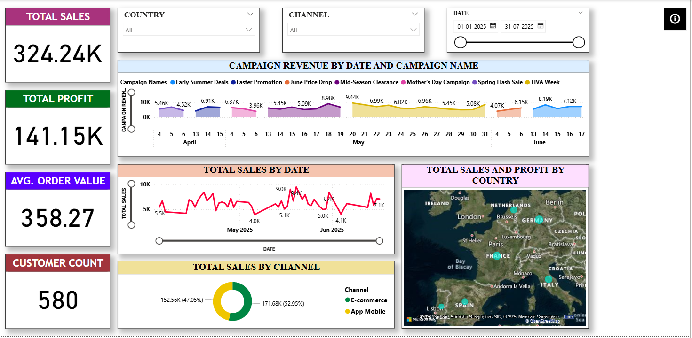
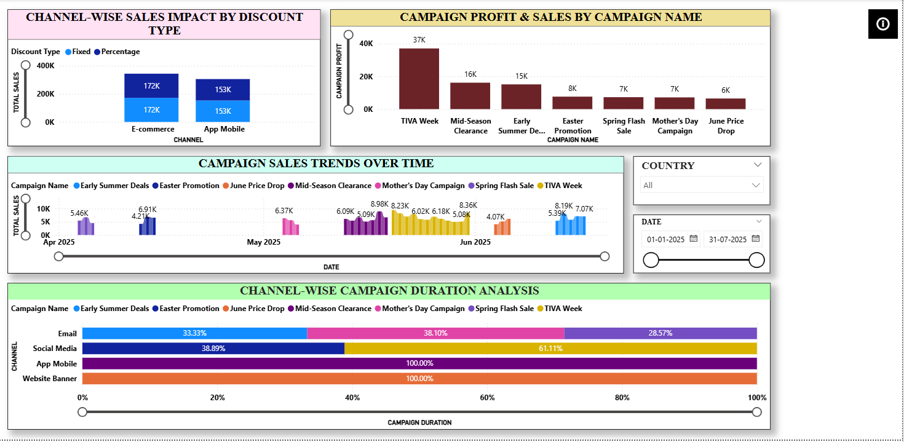

# ECommerce-European-Fashion-Retail-Dashboard

This repository contains a comprehensive Power BI report project built using a European fashion retail dataset. The dashboard provides deep insights into campaign performance, customer segmentation, sales analysis, product and inventory metrics, and channel-level performance.

---

## 📊 Dashboard Overview

The dashboard provides a comprehensive and interactive analysis of key retail business metrics. It helps uncover:

* **Total Sales & Profitability** — Overview of total sales, profit, customer count, and average order value.
* **Campaign Performance** — Insights into revenue, profit, duration, and trends across different marketing campaigns.
* **Sales by Channel & Category** — Comparative analysis of performance across E-commerce and App Mobile channels, and across product categories like Shoes, Pants, Dresses, etc.
* **Product & Inventory Insights** — Analysis of stock quantity vs. sales, profit margins, and inventory levels by product and region.
* **Customer Segmentation** — Breakdown of customer activity, age distribution, signup trends, and purchase frequency.

---

## 🚀 Key Features

* **Interactive Visuals** — Clickable charts, slicers, and tooltips for intuitive data exploration across campaigns, customers, and products.
* **Key Performance Indicators (KPIs)** — At-a-glance metrics including total sales, total profit, average order value, and customer count.
* **Segmented Analysis** — Dynamic filtering by country, channel, campaign, category, age group, and purchase behavior.
* **Actionable Insights** — Each page highlights business trends, sales drivers, inventory gaps, and campaign effectiveness to guide retail strategy.

---

## 📈 Dashboard Pages

### 1. Executive Overview

* **What it shows:** High-level KPIs with sales and profit trends, campaign revenue by date, and channel performance.
* **Key metrics:** Total sales, total profit, average order value, customer count.
* **Visuals:** KPI cards, trend lines, campaign revenue charts, pie chart by channel, map by country.
* **Insights:** Summarizes business performance across time, channels, and geography for fast decision-making.



---

### 2. Sales Deep Dive
* **What it shows:** Campaign performance by sales and profit, discount type impact by channel, and campaign sales over time.
* **Key metrics:** Campaign-wise total sales and profit.
* **Visuals:** Clustered bar charts, stacked bar (discount type), trend line over time, horizontal stacked bar for duration.
* **Insights:** Highlights top-performing campaigns and shows how discount types affect different channels.


---

### 3. Product & Inventory Analytics
* **What it shows:** Sales and stock quantity by product, category profit margins, and stock by country.
* **Key metrics:** Stock quantity, total sales, profit margin by category.
* **Visuals:** Pie chart, stacked bars, combo charts (sales vs stock), colored matrix, scatter plot.
* **Insights:** Identifies best-selling products, low-stock items, and high-margin categories to optimize inventory.


---

### 4. Campaign & Channel Performance
* **What it shows:** Profit and sales by campaign, duration analysis across channels, and sales trends by campaign name.
* **Key metrics:** Campaign profit, sales, and duration percentages.
* **Visuals:** Bar charts, line chart, stacked duration bars.
* **Insights:** Evaluates campaign effectiveness and compares which channels contributed most to campaign success.



---

### 5. Customer Insights & Segmentation
* **What it shows:** Active vs inactive customer distribution, sign-up trends, purchase frequency, and customer age demographics.
* **Key metrics:** Active customer %, customer count by age, purchase frequency.
* **Visuals:** Pie chart, line chart (signup trend), histograms, bar charts.
* **Insights:** Highlights key customer segments, retention patterns, and areas for loyalty improvement.


---

## 📂 File Structure

```
.
├── ECommerce-European-Fashion-Retail.pbix                (Power BI report file)
├── Dataset-fashion-store-campaigns.csv        (Raw dataset)
├── Dataset-fashion-store-channels.csv
├── Dataset-fashion-store-customers.csv
├── Dataset-fashion-store-products.csv
├── Dataset-fashion-store-sales.csv
├── Dataset-fashion-store-salesitems.csv
├── Dataset-fashion-store-stock.csv
├── README.md                        (Project documentation)
└── Previews/                        (Dashboard screenshot images)
    ├── ExecutiveOverview.PNG
    ├── SalesDeepDive.PNG
    ├── Product&InventoryAnalytics.PNG
    ├── Campaign&ChannelPerformance.PNG)
    └── CustomerInsights&Segmentation.PNG
```


